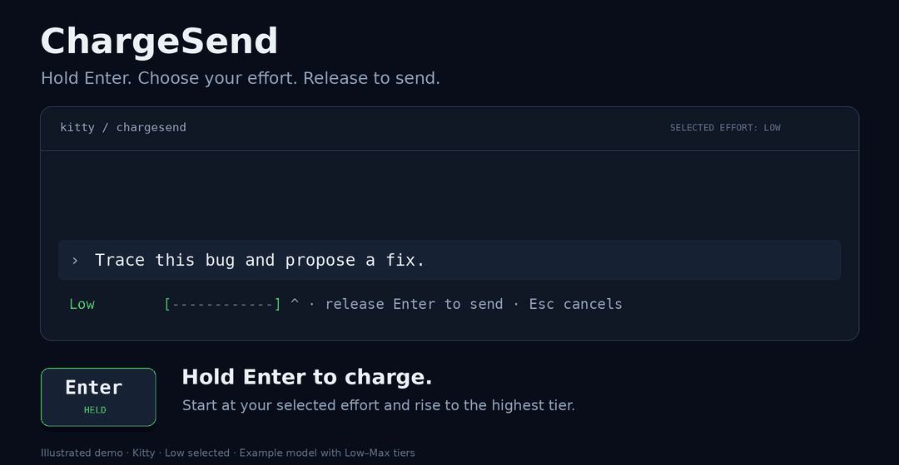

# ChargeSend

## Description

ChargeSend is an unofficial modification of Codex CLI that lets you choose
reasoning effort by holding Enter before sending a prompt. It keeps the Codex
terminal interface, authentication, settings, and agent functionality.



## Implementation

ChargeSend extends Codex's Rust `codex-tui` crate. The release-specific diffs in
[patches/](patches/) integrate with keyboard setup, event dispatch, the composer,
and prompt submission. [overlays.json](overlays.json) maps the dedicated Rust
modules into the upstream checkout; those modules are shared by the 0.161.0 and
0.160.0 patches.

**Keyboard negotiation.** [capability.rs](module/chargesend/capability.rs) enables
charging only after the keyboard-mode request succeeds and Codex's terminal probe
confirms both Kitty protocol flags: `REPORT_EVENT_TYPES` (`0x02`) and
`REPORT_ALL_KEYS_AS_ESCAPE_CODES` (`0x08`). The probe runs before the asynchronous
stdin reader takes ownership. Detection restricts charging to direct Kitty
sessions; multiplexers, SSH, disabled keyboard enhancements, or an unverified
response retain ordinary Enter handling.

**Charge controller.** [controller.rs](module/chargesend/controller.rs) implements
a generic `Controller<C, E>` that receives an eligible context and an ordered
list of effort choices. It measures elapsed time with `std::time::Instant`, rises
from the starting tier to the maximum, then repeats a descending/ascending
cycle. Continuous charge position is rounded to the nearest available tier.
Defaults are 2000 ms per direction, a 150 ms tap threshold, and a 33 ms redraw
interval, loaded from `CHARGESEND_HALF_CYCLE_MS`, `CHARGESEND_TAP_MS`, and
`CHARGESEND_FRAME_MS`. Codex's existing `FrameRequester` schedules redraws.
Repeats are consumed; release submits the last painted effort, or the selected
starting effort for a tap, so crossing a timing boundary between frames cannot
send an unseen tier.

**Input ownership.** [app_chargesend.rs](module/app_chargesend.rs) and
[chatwidget_chargesend.rs](module/chatwidget_chargesend.rs) intercept plain Enter
only in a focused, nonempty, eligible composer while the agent is idle. Native
paste classification runs first. Release reuses the normal composer submission
path, including mentions and attachments. Escape, focus loss, overlays, and
changes to the thread, draft, collaboration settings, or effort choices cancel
the charge. An application-level Enter-down latch survives widget replacement
and consumes repeats until release, preventing a cancelled hold from submitting
a different draft. Menus, slash commands, newline bindings, steering, and queued
input continue through their existing handlers.

**Request settings.** Effort choices come from the active model's
`supported_reasoning_efforts`, with duplicates and Ultra removed. Advertised Max
is included. Each new charge starts at the active collaboration mode's selected
effort, including the Plan-mode override. If the selection is unset, it uses the
active model's advertised default. An unavailable tier falls back to the nearest
supported lower tier, or the first offered tier. A `PromptEffort` envelope carries
the thread, collaboration mode, and selected effort through asynchronous image
preparation, with context validation before submission. The effort is applied to
both `Op::UserTurn.effort` and its collaboration-mode settings so Plan mode uses
the same selection. After a charged submission, subsequent requests explicitly
carry their intended effort to reset sticky backend overrides. Matching settings
echoes are normalized before updating the UI defaults. Charge selections remain
in memory and do not write to `config.toml`.

**Rendering.** [bar.rs](module/chargesend/bar.rs) draws a 12-cell RGB
green-to-yellow-to-red meter in the composer's measured footer space.
[status.rs](module/chargesend/status.rs) appends the submitted turn's effort after
the Working timer and interrupt hint. That label tracks the active request;
steering or preparing a queued prompt does not replace it. Width checks preserve
the timer and controls by hiding the suffix when it cannot fit.

**Build and verification.** [chargesend.py](scripts/chargesend.py) verifies the
release tag's pinned commit, checks the patch before applying it, and records
source and patch fingerprints. It aligns only local workspace versions in
`Cargo.lock`, preserving third-party pins, and builds with `--locked`. The bundle
contains the native CLI and a matching `codex-code-mode-host`, reused from an
installed official package of the same version or compiled from source using
Codex's checksum-verified V8 archive and bindings. Its manifest records the
baseline, toolchain, fingerprints, and executable checksums. Tests exercise the
real composer and submission code through a mock operation receiver and a
backend that simulates sticky effort settings. GitHub Actions applies, tests,
lints, and builds both supported releases, then checks launcher installation and
removal.

## Setup

Use Ubuntu 26.04 and a direct Kitty terminal, outside tmux, Screen, Zellij, or SSH.
Charging requires keyboard release events; unsupported terminals use ordinary
Enter submission.

From the repository directory:

```bash
bash scripts/setup-ubuntu.sh
export PATH="$HOME/.cargo/bin:$PATH"
python3 scripts/chargesend.py build --tag rust-v0.161.0
python3 scripts/chargesend.py install \
  --bundle dist/chargesend-0.1.0-codex-0.161.0-x86_64-unknown-linux-gnu-dev \
  --as-codex
export PATH="$HOME/.local/bin:$PATH"
```

The setup script installs Rust 1.95.0, native build dependencies, and Kitty.
Installation places ChargeSend under `~/.local`. `--as-codex` makes `codex` launch
ChargeSend and saves the original command as `codex-stock`.

## Usage

Open Kitty and run:

```bash
codex
```

Resume a session with `codex resume <session-id>`. After updating ChargeSend,
exit with `/quit` and reopen it.

Type a prompt while the agent is idle:

| Action | Behavior |
| --- | --- |
| Tap Enter | Send at the reasoning effort currently selected for the active model and mode. |
| Hold Enter | Rise to the highest offered tier over two seconds, descend to the lowest over two seconds, then repeat. |
| Release Enter | Send once at the displayed effort. |
| Press Escape while holding | Cancel and retain the draft and attachments. Release Enter before trying again. |

The charge bar uses the active model's supported tiers, excluding Ultra.
Charging applies to new turns. Menus, newline shortcuts, pasting, attachments,
and steering or queueing during a running turn retain their normal behavior.

While a task runs, its submitted effort appears after the timer and cancel hint:

```text
Working (1m 34s • esc to interrupt) · xHigh Reasoning
```

Choose the model and reasoning effort with Codex's `/model` picker. Select Low
to start and tap at Low, or select High to start and tap at High. If the effort is
unset, the model's default is used. Holding Enter starts at that selection and
cycles through the available tiers; releasing sends at the displayed tier.

Adjust charge timing when launching:

```bash
CHARGESEND_HALF_CYCLE_MS=1000 codex
```

The example uses one second per direction. `CHARGESEND_DEFAULT_EFFORT` is no
longer used; the selected reasoning effort determines the starting tier.
